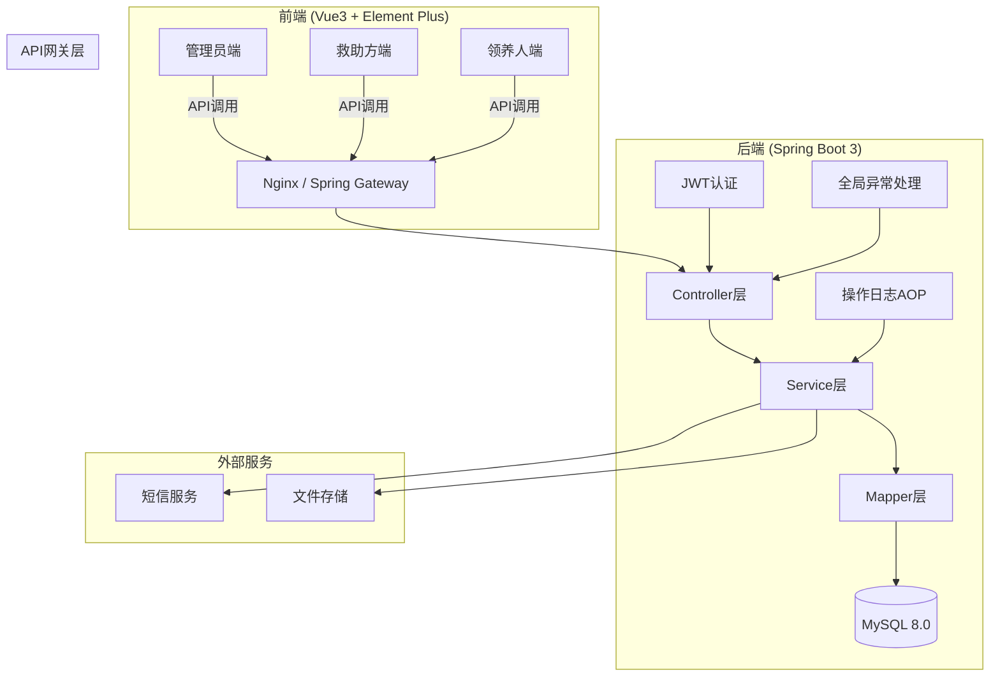
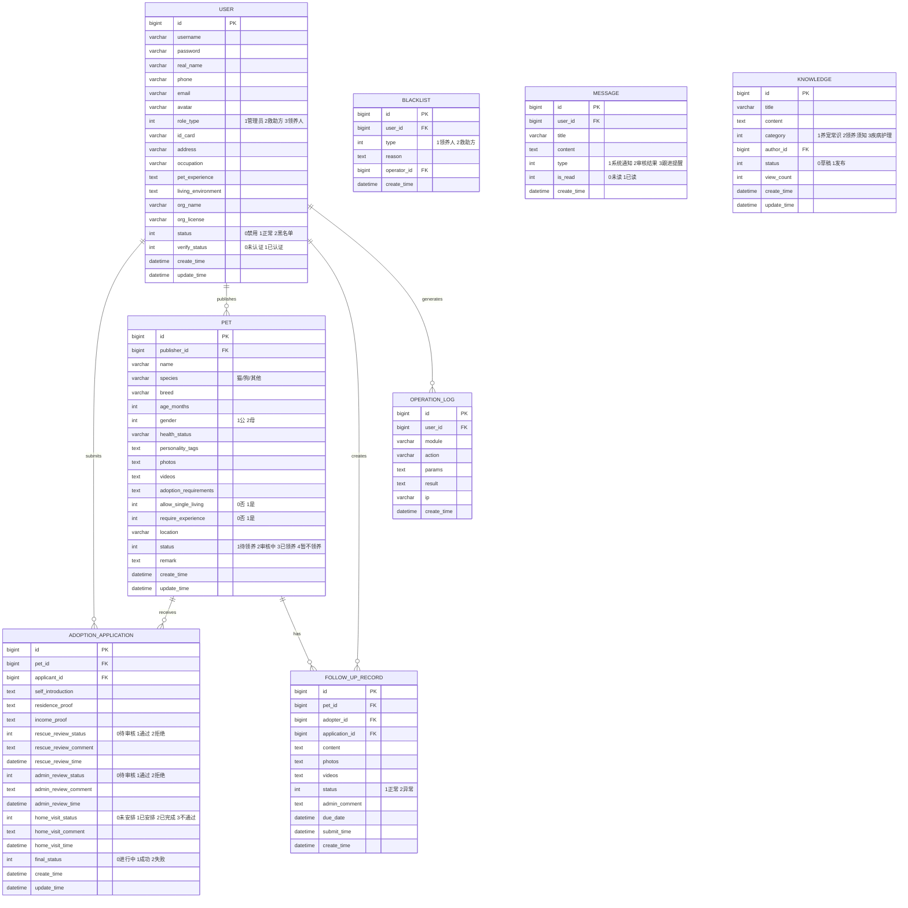

# 宠物领养系统 - 项目设计文档

## 1. 系统架构



## 2. ER图



## 3. 接口清单

### 3.1 用户模块 (UserController)
| 方法 | 路径 | 描述 |
|------|------|------|
| POST | /api/user/register | 用户注册 |
| POST | /api/user/login | 用户登录 |
| GET | /api/user/info | 获取当前用户信息 |
| PUT | /api/user/update | 更新用户信息 |
| POST | /api/user/verify | 提交实名认证 |
| GET | /api/user/list | 用户列表(管理员) |
| PUT | /api/user/status | 更新用户状态 |

### 3.2 宠物模块 (PetController)
| 方法 | 路径 | 描述 |
|------|------|------|
| POST | /api/pet/create | 发布宠物信息 |
| PUT | /api/pet/update | 更新宠物信息 |
| GET | /api/pet/detail/{id} | 宠物详情 |
| GET | /api/pet/list | 宠物列表(支持筛选) |
| PUT | /api/pet/status | 更新宠物状态 |
| DELETE | /api/pet/delete/{id} | 删除宠物 |
| GET | /api/pet/my-list | 我发布的宠物 |

### 3.3 领养申请模块 (AdoptionController)
| 方法 | 路径 | 描述 |
|------|------|------|
| POST | /api/adoption/apply | 提交领养申请 |
| GET | /api/adoption/my-applications | 我的申请列表 |
| GET | /api/adoption/received | 收到的申请(救助方) |
| GET | /api/adoption/pending-review | 待复核列表(管理员) |
| PUT | /api/adoption/rescue-review | 救助方审核 |
| PUT | /api/adoption/admin-review | 管理员复核 |
| PUT | /api/adoption/home-visit | 更新家访状态 |
| GET | /api/adoption/detail/{id} | 申请详情 |

### 3.4 后续跟进模块 (FollowUpController)
| 方法 | 路径 | 描述 |
|------|------|------|
| POST | /api/follow/submit | 提交跟进记录 |
| GET | /api/follow/my-records | 我的跟进记录 |
| GET | /api/follow/pet-records/{petId} | 宠物跟进记录 |
| GET | /api/follow/pending | 待跟进列表 |
| PUT | /api/follow/review | 审核跟进记录 |
| POST | /api/follow/reclaim | 回收宠物 |

### 3.5 黑名单模块 (BlacklistController)
| 方法 | 路径 | 描述 |
|------|------|------|
| POST | /api/blacklist/add | 添加黑名单 |
| DELETE | /api/blacklist/remove/{id} | 移除黑名单 |
| GET | /api/blacklist/list | 黑名单列表 |

### 3.6 消息模块 (MessageController)
| 方法 | 路径 | 描述 |
|------|------|------|
| GET | /api/message/list | 消息列表 |
| PUT | /api/message/read/{id} | 标记已读 |
| PUT | /api/message/read-all | 全部已读 |
| GET | /api/message/unread-count | 未读数量 |

### 3.7 知识库模块 (KnowledgeController)
| 方法 | 路径 | 描述 |
|------|------|------|
| POST | /api/knowledge/create | 创建文章 |
| PUT | /api/knowledge/update | 更新文章 |
| GET | /api/knowledge/list | 文章列表 |
| GET | /api/knowledge/detail/{id} | 文章详情 |
| DELETE | /api/knowledge/delete/{id} | 删除文章 |

### 3.8 文件上传 (FileController)
| 方法 | 路径 | 描述 |
|------|------|------|
| POST | /api/file/upload | 上传文件 |

## 4. UI/UX 规范

### 4.1 色彩体系
```scss
// 主色调 - 温暖橙色系
$primary-color: #FF6B35;
$primary-light: #FF8C5A;
$primary-dark: #E55A2B;

// 辅助色
$success-color: #52C41A;
$warning-color: #FAAD14;
$error-color: #F5222D;
$info-color: #1890FF;

// 中性色
$text-primary: #303133;
$text-regular: #606266;
$text-secondary: #909399;
$text-placeholder: #C0C4CC;

// 背景色
$bg-base: #F5F7FA;
$bg-card: #FFFFFF;
$bg-hover: #F2F6FC;

// 边框色
$border-base: #DCDFE6;
$border-light: #E4E7ED;
```

### 4.2 字体规范
```scss
$font-family: -apple-system, BlinkMacSystemFont, 'Segoe UI', Roboto, 'Helvetica Neue', Arial, sans-serif;

$font-size-large: 18px;
$font-size-medium: 16px;
$font-size-base: 14px;
$font-size-small: 12px;

$font-weight-bold: 600;
$font-weight-medium: 500;
$font-weight-regular: 400;
```

### 4.3 间距规范
```scss
$spacing-xs: 4px;
$spacing-sm: 8px;
$spacing-md: 16px;
$spacing-lg: 24px;
$spacing-xl: 32px;
```

### 4.4 圆角规范
```scss
$border-radius-sm: 4px;
$border-radius-base: 8px;
$border-radius-lg: 12px;
$border-radius-round: 20px;
```

### 4.5 阴影规范
```scss
$shadow-sm: 0 2px 8px rgba(0, 0, 0, 0.08);
$shadow-base: 0 4px 12px rgba(0, 0, 0, 0.1);
$shadow-lg: 0 8px 24px rgba(0, 0, 0, 0.12);
```

## 5. 页面结构

### 5.1 管理员端
- 首页仪表盘
- 用户管理（救助方/领养人审核）
- 宠物管理
- 领养申请复核
- 黑名单管理
- 知识库管理
- 操作日志

### 5.2 救助方端
- 我的宠物管理
- 领养申请处理
- 跟进记录查看
- 消息中心

### 5.3 领养人端
- 宠物浏览与筛选
- 我的申请
- 跟进记录提交
- 消息中心
- 知识库浏览
